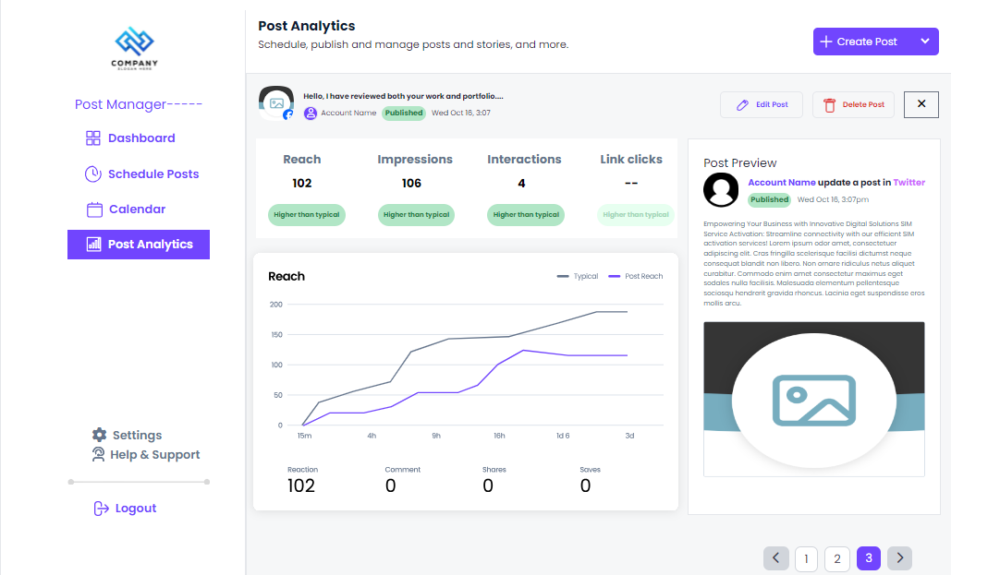

<h1 align="center"> Dashboard</h1>
<h3 align="center">Html Template</h3>

All Details of Social Dashboards

## Project Live Link:

https://ela60.github.io/3-screen-Dhashboard/

## Project Layout:

## OverView Project:
1. Screen-1(Schedule Posts):
  
2. Screen-2(Calender):
  
3. Screen-3(Post Analytics):
  

## Features:
<ol>
    <li>Fully responsive design</li>
    <li>Clean and modern layout</li>
    <li>Easy-to-navigate menu sections</li>
    <li>Perfect for Dashboard</li>
    <li>Cross-browser compatibility</li>
</ol>

## Technology Used:

<ol>
    <li>HTML</li>
    <li>TAILWIND CSS</li>
    <li>DAISY UI</li>
    <li>Javascript</li>
</ol>

